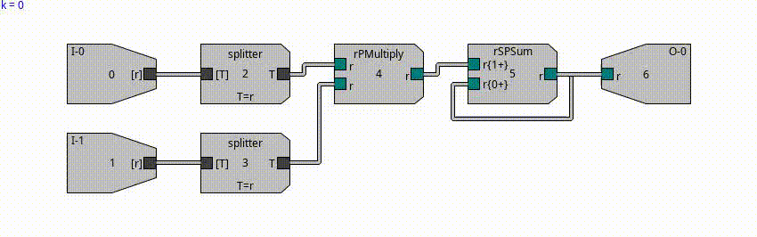

# Typed Token Processing Network (TTPN)

A Java framework for experimenting with TTPNs.

Based mainly on [JGEA](https://github.com/ericmedvet/jgea).

## Installation

## Requirements

- Java 21+ (check with `java -version`)
- Maven 3.8+ (check with `mvn -version`)


### Clone and build

Java 21+ and Maven 3.8+ are required.


You can clone this project and build it with:
```shell
git clone https://github.com/berfins/ttpn.git
cd ttpn
mvn clean package -DskipTests
```

This compiles the module and produces:

a normal jar: `io.github.berfins.ttpn.main/target/io.github.berfins.ttpn.main-1.0.0-SNAPSHOT.jar`

a fat jar (all dependencies): `io.github.berfins.ttpn.main/target/ttpn-standalone.jar`


```shell
java -jar io.github.berfins.ttpn.main/target/ttpn-standalone.jar
```

If everything is working correctly, you should see:

```Hello from TTPN project!```

## Usage

### Example Problem

You can run an example by invoking:

```shell
mvn -pl io.github.berfins.ttpn.main \
    -Dexec.mainClass=io.github.berfins.ttpn.ApplyInput \
    exec:java
   ```

What you should see:
- Console print (network outcome).
- An image of the TTPN saved to `../ttpn-vProduct.png`.
- A video file written to `../ttpn-vProduct.mp4`.

What this example (vector product) does:

- Builds a small TTPN with:
  - 2 sequence inputs (reals),  
  ```Gate.input(Composed.sequence(Base.REAL)),```

  - splitters, a real multiplication gate, a sum gate,

  - 1 real output.
```Gate.output(Base.REAL)```


    Network n = new Network(
        List.of(
            Gate.input(Composed.sequence(Base.REAL)),
            Gate.input(Composed.sequence(Base.REAL)),
            Gates.splitter(),
            Gates.splitter(),
            Gates.rPMathOperator(Element.Operator.MULTIPLICATION),
            Gates.rSPSum(),
            Gate.output(Base.REAL)
        ),
        Set.of(
            Wire.of(0, 0, 2, 0),
            Wire.of(1, 0, 3, 0),
            Wire.of(2, 0, 4, 0),
            Wire.of(3, 0, 4, 1),
            Wire.of(4, 0, 5, 0),
            Wire.of(5, 0, 5, 1),
            Wire.of(5, 0, 6, 0)
        )
    );


- Uses a ```Drawer``` to visualize and save this network.

- Uses a ````Runner```` to execute the network on example inputs:

      Runner.TTPNInstrumentedOutcome outcome = runner.run(
          n,
          List.of(
              List.of(1.0, 2.0, 3.0),
              List.of(4.0, 5.0, 6.0)
          )
      );

The example input can be modified here.

- Prints the outputs and a profile of the run.

```[32.0]```

```{steps=7, avg.count=3.3, avg.size=3.9}```


- Saves an image of the static network and video of the network with visible execution trace. 





## References
1. <a name="2025-ttpn"></a> Sakallioglu, Nadizar, Manzoni, Medvet; [Evolving Typed Token Processing Networks](https://berfins.github.io/sakallioglu2025ttpn.html); ACM Genetic and Evolutionary Computation Conference (GECCO); 2025
2. <a name="2022-c-mnm-jgea"></a>Medvet, Nadizar, Manzoni; [JGEA: a Modular Java Framework for Experimenting with Evolutionary Computation](https://medvet.inginf.units.it/publications/2022-c-mnm-jgea/); Workshop Evolutionary Computation Software Systems (EvoSoft@GECCO); 2022